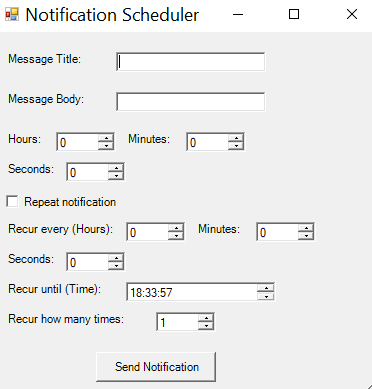
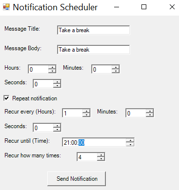
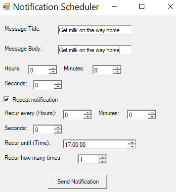
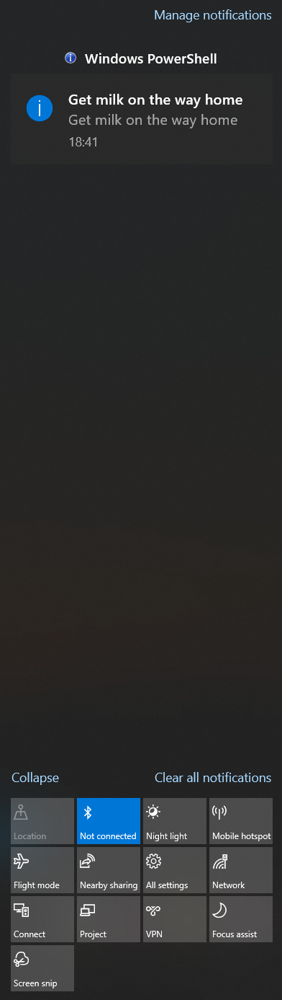
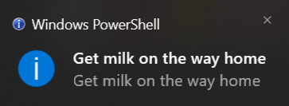
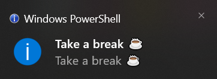

# Notification scheduler for windows

## Features

- No additional dependencies
- Easy UI to make a notification message
- Set recurrence of the notification

## Installation

git clone `https://github.com/adam-coates/windows-notification-scheduler`

## Examples

1. Type title and message

2. Select when the notification should occur (or reoccur)

---

- Easily set up a notification to remind you to take a screen break

## Notifications appear in the notification area of the taskbar

